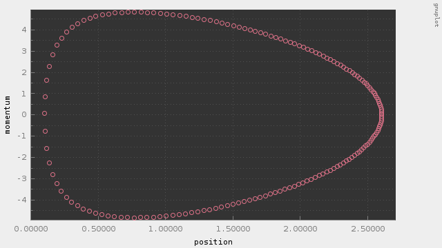
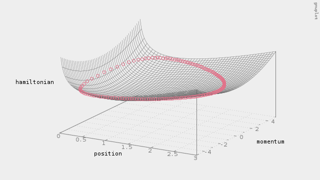
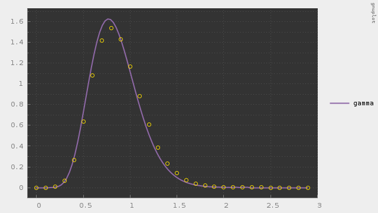
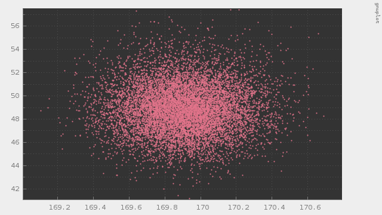

# hmc

Hamiltonian Monte Carlo method

---

#### これは何？

MCMCのハミルトニアンモンテカルロ法のC++によるフルスクラッチです。

##### 概要

メトロポリス・ヘイスティングス法の遷移にランダムウォークを採用した場合、移動距離の分散を適切に設定しないといけないという問題があります。また、高次元空間では次元の呪いの影響で受容率が低くなるため、なかなか収束しないという問題もあります。ハミルトニアンモンテカルロ法はランダムウォーク系のMCMCとは違い、高次元空間でも平均移動距離が長く取ることができ、受容率も高くなるため、現実的な時間内に収束するのが特徴です。

メトロポリスヘイスティングス法に関してはこちら。
https://github.com/hiroyam/metropolis-hastings

##### 動作サンプル

リープフロッグで遷移している様子をプロットしました。

ハミルトニアンを保存しながら遷移しているのが分かります。

d=1の場合のHMCとしてガンマ分布に従う乱数を発生させた例です。受容率は99%でした。

d=2の場合のHMCとして標本からガウス分布のパラメタを推定してみた例です。受容率は99%でした。

